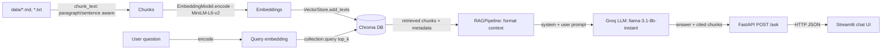

# RAG Knowledge Assistant

A small, end-to-end Retrieval-Augmented Generation (RAG) system: it chunks
and embeds a corpus of documents, indexes them in a local Chroma vector
store, retrieves the most relevant chunks for a user's question, and asks
an LLM (via [Groq](https://groq.com)) to answer using only that retrieved
context. A FastAPI backend exposes it as an HTTP API, and a Streamlit app
provides a chat UI on top of that API.

This is a portfolio project — the goal is a correct, honestly-documented,
reproducible reference implementation of the core RAG pattern, not a
production search engine.

## Problem statement

Plain LLM chat has two well-known weaknesses: it can't answer questions
about documents it wasn't trained on, and it will confidently hallucinate
an answer rather than say "I don't know." RAG addresses both by retrieving
relevant source text at query time and instructing the model to answer
*only* from that text (and to say so when the answer isn't in it), which
also gives the user a way to verify the answer against its cited source
chunks.

This project demonstrates that pattern end-to-end: ingestion, chunking,
embedding, vector search, and grounded generation, wired together behind a
real API and UI rather than left as a notebook.

## Architecture

```
                    ┌─────────────────────────────────────────┐
                    │              INGESTION (offline)         │
                    │                                           │
  data/*.md,*.txt ──▶  chunk_text()  ──▶ EmbeddingModel.encode()│
                    │  (paragraph/     (sentence-transformers/  │
                    │   sentence       all-MiniLM-L6-v2)        │
                    │   aware)              │                   │
                    └────────────────────────┼──────────────────┘
                                              ▼
                                     ┌────────────────┐
                                     │   Chroma DB     │
                                     │ (chroma_db/,     │
                                     │  HNSW index)     │
                                     └────────┬────────┘
                                              │
                    ┌─────────────────────────┼──────────────────┐
                    │              QUERY (online)                │
                    │                         ▼                   │
  question ──▶ EmbeddingModel.encode() ──▶ collection.query()     │
                    │                         │  (top-K chunks)   │
                    │                         ▼                   │
                    │              RAGPipeline._format_context()  │
                    │                         │                   │
                    │                         ▼                   │
                    │            LLMClient.generate()  ──▶ Groq   │
                    │              (llama-3.1-8b-instant)         │
                    └─────────────────────────┼───────────────────┘
                                              ▼
                                   ┌────────────────────┐
                                   │  FastAPI  /ask       │
                                   │  (api/main.py)       │
                                   └──────────┬──────────┘
                                              │ HTTP
                                              ▼
                                   ┌────────────────────┐
                                   │  Streamlit chat UI   │
                                   │  (streamlit_app.py)  │
                                   └────────────────────┘
```

Mermaid version (renders on GitHub):



### Components

| Module | Responsibility |
|---|---|
| `rag/ingest.py` | Walks `data/`, splits text into boundary-aware chunks, sends them to the vector store. |
| `rag/embeddings.py` | Wraps `sentence-transformers/all-MiniLM-L6-v2` for encoding text into vectors. |
| `rag/vectorstore.py` | Thin wrapper around a persistent Chroma collection (`add_texts`, `query`). |
| `rag/llm.py` | Thin wrapper around the Groq chat completions API. |
| `rag/rag_chain.py` | Glues retrieval + prompt construction + generation into `RAGPipeline.answer(question)`. |
| `api/main.py` | FastAPI app exposing `GET /health` and `POST /ask`. |
| `streamlit_app.py` | Chat UI that calls the FastAPI `/ask` endpoint and displays cited context. |

## Setup

### 1. Prerequisites

- Python 3.11+
- A [Groq API key](https://console.groq.com/keys) (free tier is fine)

### 2. Install

```bash
python -m venv .venv
source .venv/bin/activate        # Windows: .venv\Scripts\activate
pip install -r requirements.txt -r requirements-dev.txt
```

### 3. Configure

```bash
cp .env.example .env
# then edit .env and set GROQ_API_KEY
```

### 4. Ingest the sample corpus

The knowledge base is a set of small, original, public sample documents in
`data/samples/` (see [`data/README.md`](data/README.md) — no personal or
private data is included, by design, so this repo is safe and reproducible
for anyone who clones it).

```bash
python -m rag.ingest
```

This embeds every `.md`/`.txt` file under `data/` (except `data/README.md`
itself) and writes the vectors into a local Chroma store at `chroma_db/`
(git-ignored — regenerate it locally rather than committing it).

### 5. Run the API

```bash
uvicorn api.main:app --host 0.0.0.0 --port 9000
```

### 6. Run the Streamlit frontend

In a second terminal:

```bash
streamlit run streamlit_app.py
```

By default the frontend calls the API at `http://127.0.0.1:9000/ask`
(override with the `RAG_API_URL` env var — see `.env.example`).

### Docker Compose (alternative to steps 5–6)

```bash
cp .env.example .env   # if you haven't already
docker compose run --rm ingest      # build the vector index once
docker compose up api frontend      # start the API + chat UI
```

The Streamlit UI will be at `http://localhost:8501`, the API at
`http://localhost:9000`. The Chroma index is persisted in a named Docker
volume (`chroma_data`), so it survives container restarts; re-run
`docker compose run --rm ingest` whenever `data/` changes.

## Example queries

Retrieval was run for real against the ingested sample corpus (captured
directly from `VectorStore.query`, not fabricated):

```
$ python -c "
from rag.vectorstore import VectorStore
vs = VectorStore()
r = vs.query('How does a token bucket rate limiter work?', top_k=3)
for doc, meta in zip(r['documents'][0], r['metadatas'][0]):
    print(meta['source'], '-', doc[:80])
"

rate_limiting.md - Excess requests either wait in the queue or are dropped once
                    it's full. Unlike token bucket, leaky bucket smooths...
rate_limiting.md - ## Sliding Window Counter A practical middle ground: keep
                    counts for the current and previous fixed windows...
rate_limiting.md - # API Rate Limiting Strategies Rate limiting caps how many
                    requests a client can make in a given time window...
```

The top hit is the `rate_limiting.md` chunk that literally defines token
bucket, confirming retrieval is working end-to-end.

The final `POST /ask` response additionally runs those retrieved chunks
through the Groq LLM. This environment had no `GROQ_API_KEY` configured, so
rather than fabricate a captured transcript, here is a **representative**
example of the full response shape you'll get once you supply your own key:

```
POST /ask
{"question": "How does a token bucket rate limiter work?"}

200 OK
{
  "answer": "A token bucket holds up to B tokens and refills at a steady
  rate r tokens per second. Each incoming request consumes one token; if
  the bucket is empty, the request is rejected or delayed. This allows
  short bursts up to the bucket's capacity while still enforcing a steady
  average rate over time.",
  "context": [
    {"text": "...Token Bucket A bucket holds up to B tokens...",
     "metadata": {"source": "rate_limiting.md", "chunk_index": 3}},
    ...
  ]
}
```

## Tech stack

| Layer | Technology |
|---|---|
| Embeddings | `sentence-transformers` (`all-MiniLM-L6-v2`, 384-dim) |
| Vector store | [Chroma](https://www.trychroma.com/) (`PersistentClient`, on-disk HNSW index) |
| LLM | [Groq](https://groq.com) hosted inference (`llama-3.1-8b-instant`) |
| Backend API | FastAPI + Pydantic + Uvicorn |
| Frontend | Streamlit (chat UI) |
| Testing | pytest, FastAPI `TestClient` |
| Lint | ruff |
| CI | GitHub Actions |
| Packaging | Docker + Docker Compose |

## Chunking

Text is split on paragraph boundaries, then sentence boundaries, and
greedily packed into chunks under a token-count budget (`CHUNK_SIZE` in
`rag/config.py`, currently 200 whitespace-delimited "tokens"), carrying a
small amount of trailing context (`CHUNK_OVERLAP`, 40 tokens) into the next
chunk for retrieval continuity. This avoids the failure mode of naive
fixed-character-count slicing, which can cut a sentence (or a word) in
half mid-chunk. See `rag/ingest.py::chunk_text` and
`tests/test_chunking.py` (including the `overlap >= chunk_size` edge case,
which the original character-slicing implementation would loop on forever).

## Testing

```bash
pytest -v
```

17 tests covering:
- `chunk_text` unit tests (boundary handling, overlap, the
  overlap-exceeds-chunk-size edge case, empty input, `chunk_size <= 0`).
- `VectorStore` add/query round-trip, using a deterministic fake embedder
  and a temporary Chroma directory (never touches real data or downloads
  model weights).
- `POST /ask` integration test via FastAPI's `TestClient`, with the RAG
  pipeline swapped out via `app.dependency_overrides` for a fake that
  returns a canned answer — no real Groq API calls or embedding model
  loads happen in the test suite.

## Limitations

- **Tiny demo corpus.** Five short sample documents is enough to prove the
  pipeline works end-to-end, not enough to demonstrate retrieval quality at
  scale. Swap in your own `data/` files for a real evaluation.
- **No re-ranking.** Retrieval is a single cosine-similarity ANN search
  (Chroma's default HNSW index) with no cross-encoder re-ranking step, so
  borderline-relevant chunks can occasionally outrank better ones.
- **Token-count proxy, not a real tokenizer.** `chunk_text`'s token budget
  is a whitespace-split word count, not an actual LLM tokenizer count, so
  chunk sizes are approximate (usually within ~20-30% of true token count
  for English prose).
- **No conversation memory in the pipeline.** The Streamlit UI keeps chat
  history client-side for display, but each `/ask` call is answered from
  the retrieved context alone — the LLM doesn't see prior turns.
- **No authentication/rate limiting on the API.** `api/main.py` is a bare
  FastAPI app with no auth, no request throttling, and no input sanitization
  beyond Pydantic's type validation — fine for a local demo, not for a
  public deployment.
- **No streaming.** Responses are generated and returned in one shot; there's
  no token-by-token streaming from Groq to the client.
- **Single collection, single embedding model.** There's no support for
  multiple document collections, incremental re-indexing (`ingest.py`
  always appends rather than diffing against what's already indexed), or
  swapping embedding models without re-embedding everything.
- **Dockerfile/compose validated for syntax, not a full build.** The
  Docker setup was checked with `docker compose config` in the environment
  this was developed in (no local Docker daemon available there); build it
  yourself before relying on it (`docker compose build`).

## Project layout

```
.
├── api/
│   └── main.py            # FastAPI app (/health, /ask)
├── rag/
│   ├── config.py           # paths, model name, chunk size/overlap, top_k
│   ├── embeddings.py        # sentence-transformers wrapper
│   ├── ingest.py            # chunking + ingestion entrypoint
│   ├── llm.py                # Groq client wrapper
│   ├── rag_chain.py          # retrieval + prompt + generation glue
│   └── vectorstore.py        # Chroma wrapper
├── data/
│   ├── README.md              # describes the sample corpus
│   └── samples/                 # 5 original, public, PII-free sample docs
├── tests/                        # pytest suite (unit + integration)
├── streamlit_app.py               # chat frontend
├── Dockerfile
├── docker-compose.yml
├── .env.example
├── requirements.txt                # pinned runtime deps
├── requirements-dev.txt             # + pytest, httpx, ruff
└── .github/workflows/ci.yml          # lint + test on push/PR
```
